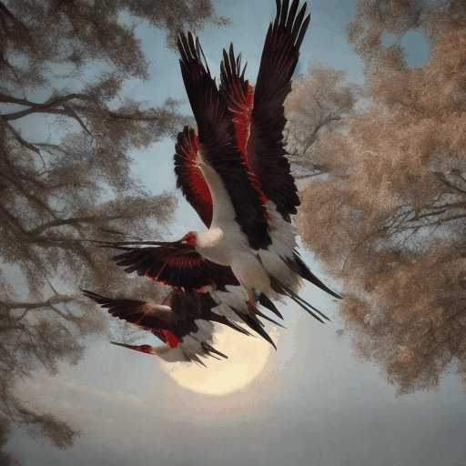
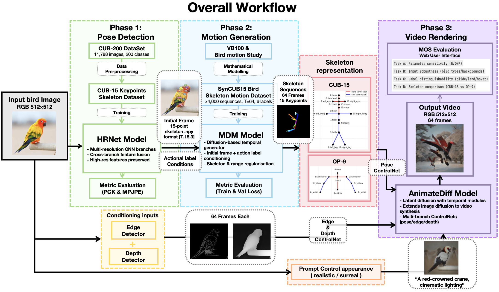
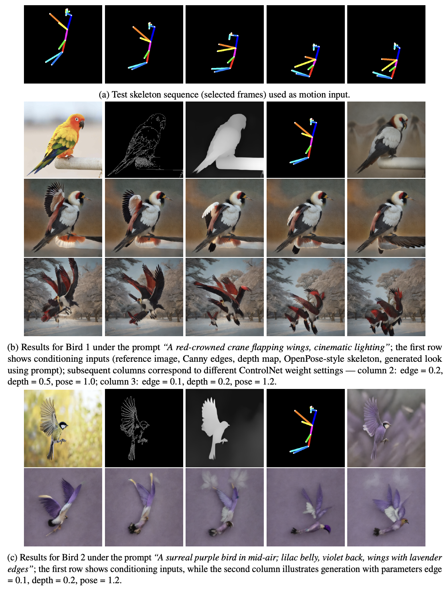
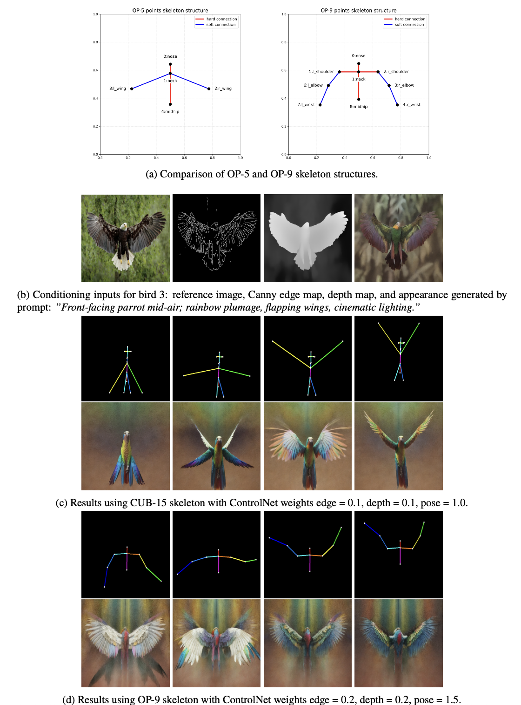
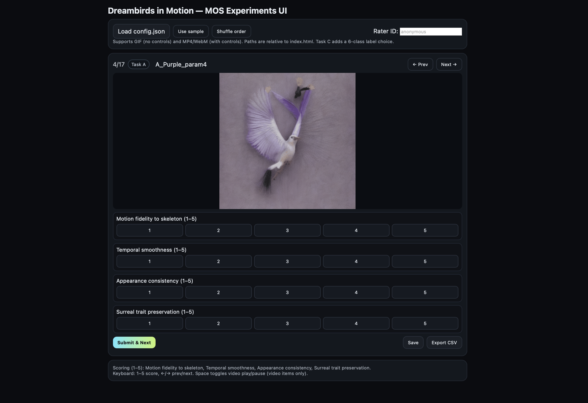

# Dreambirds in Motion: Pose-Guided Surreal Bird Video Generation

<p align="center">
  
  
  
</p>

## 1. Introduction
This project explores whether skeleton-driven generative methods can produce **temporally coherent** and **stylistically consistent** bird motion videos.  
We built a three-stage pipeline:
1. **HRNet** for bird keypoint detection (CUB-15 skeleton).
2. **Motion Diffusion Model (MDM)** for generating pose sequences.
3. **AnimateDiff + ControlNet** for rendering skeleton-guided surreal bird videos.

To support training and evaluation, we created a custom dataset **SynCUB15**, derived from the [CUB-200-2011 dataset](http://www.vision.caltech.edu/visipedia/CUB-200-2011.html).  

- **CUB-15 Skeleton Definition**: 15 annotated bird keypoints (beak, crown, nape, back, tail, left/right wings, legs, etc.), designed specifically for bird morphology.  
- **COCO-format Conversion**: All annotations were converted into COCO JSON format with skeleton topology, enabling training in [MMPose](https://github.com/open-mmlab/mmpose).  
- **Biomechanical Augmentation**: Synthetic variations were generated with constraints on wing angles, body jitter, and symmetry to enrich motion diversity.  
- **Quality Checks**: Scripts ensure annotation consistency, correct skeleton connectivity, and visualization for manual verification.  

The aim is to combine scientific modelling of motion with artistic freedom, inspired by the *Birds of the British Empire* project.

---

## 2. Results
We demonstrate controllable and surreal bird motion videos:
- **Motion fidelity**: skeleton-following wing flaps, glides, and landings.
- **Temporal smoothness**: no flicker across frames.
- **Surreal preservation**: artistic prompts (e.g., “purple birds with crystal wings”) remain consistent.  

🖌️ **Total pipeline workflow**



🖼️ <b>Demo frames</b>:

<!-- 
 -->
<div align="center">
  
</div>
<div align="center">
  
</div>


<!-- 📹 **Demo Videos**:  


 -->


🎨 **Screen shot of the WebUI I built for video quality evaluation**
<div align="center">
  
</div>

---

## 3. Repository Structure
```text
Dreambirds_in_Motion_IRP/
│── Full_Codes_for_IRP/         # Main training and inference scripts
│── MOS_Evaluation_WebUI/       # Web interface for human evaluation
│── Report_LatexFormat/         # LaTeX files for academic report
│── Workflow.png                # Project workflow diagram
│── Project_Report.pdf          # Full project report
│── IRP_vivas.pptx              # Presentation slides
│── README.md                   # This file
```


## 4. References

This project builds upon the following open-source models and libraries:

```bibtex
@article{sun2019deep,
  title={Deep High-Resolution Representation Learning for Human Pose Estimation},
  author={Sun, Ke and Xiao, Bin and Liu, Dong and Wang, Jingdong},
  journal={CVPR},
  year={2019}
}

@article{tevet2022motion,
  title={Motion Diffusion Model for Human Motion Generation},
  author={Tevet, Guy and others},
  journal={arXiv preprint arXiv:2209.14916},
  year={2022}
}

@article{guo2023animatediff,
  title={AnimateDiff: Animate Your Personalized Text-to-Image Diffusion Models without Specific Tuning},
  author={Guo, Shuai and others},
  journal={arXiv preprint arXiv:2307.04725},
  year={2023}
}

@article{zhang2023adding,
  title={Adding Conditional Control to Text-to-Image Diffusion Models},
  author={Zhang, Lvmin and others},
  journal={arXiv preprint arXiv:2302.05543},
  year={2023}
}
```

We gratefully acknowledge the authors of these works for making their code and models publicly available.


